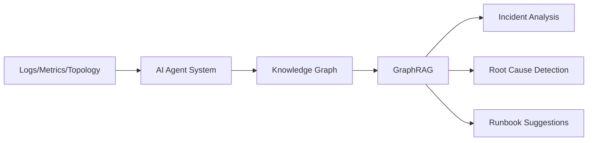

<div align="center">

# 🤖 AI Distributed Systems Assistant

### Local-first GraphRAG and multi-agent system for distributed infrastructure analysis

[](https://opensource.org/licenses/MIT)
[](https://www.python.org/downloads/)
[](https://fastapi.tiangolo.com)
[](https://neo4j.com)

[Architecture](docs/ARCHITECTURE.md) • [Getting Started](#-quick-start) • [Roadmap](#-roadmap)

</div>

---

## 🎯 Overview

An intelligent assistant that helps you understand complex distributed systems by correlating logs, metrics, and topology into actionable insights.

**Built for operators who need answers, not dashboards.**

### What It Does



- 🔍 **Ingests** topology (services, nodes, pods), logs (via Loki), and metrics (via Prometheus)
- 🧠 **Analyzes** using GraphRAG + multi-agent workflows
- 💡 **Explains** incidents, correlates events, and suggests remediation steps
- 🏠 **Runs locally** on your own hardware with open-source models

---

## 🏗️ Architecture

### Core Components

| Layer | Technology | Purpose |
|-------|-----------|---------|
| **API** | FastAPI | HTTP endpoints and orchestration |
| **Knowledge** | MariaDB + Neo4j | Vector storage + graph relationships |
| **Observability** | Prometheus, Loki, Grafana | Metrics, logs, and dashboards |
| **AI** | Multi-agent system | Specialized agents for topology, logs, and analysis |

### Agent System

```
┌─────────────┐
│   Planner   │  Routes queries to specialist agents
└──────┬──────┘
       │
   ┌───┴────┬────────┬─────────┐
   │        │        │         │
┌──▼──┐ ┌──▼───┐ ┌──▼──────┐ ┌▼────────┐
│ Log │ │Topo  │ │Explainer│ │Runbook  │
│Agent│ │Agent │ │ Agent   │ │Agent    │
└─────┘ └──────┘ └─────────┘ └─────────┘
```

**Topology Agent** → Syncs cluster/service graph into Neo4j  
**Log Agent** → Analyzes logs and creates incident nodes  
**Explainer Agent** → Uses GraphRAG to explain what's happening  
**Runbook Agent** → Links incidents to relevant documentation

---

## 🚀 Quick Start

### Prerequisites

- Docker + docker-compose
- (Optional) Python 3.12 for local development

### Launch the Stack

```bash
# Clone the repository
git clone https://github.com/PeterGreenAppliedAI/ai-distributed-systems-assistant.git
cd ai-distributed-systems-assistant

# Start all services
docker-compose -f infra/docker-compose.yml up --build

# Verify services are running
curl http://localhost:8000/health
```

### Access Points

| Service | URL | Purpose |
|---------|-----|---------|
| API | http://localhost:8000 | FastAPI backend |
| Neo4j Browser | http://localhost:7474 | Graph database UI |
| Grafana | http://localhost:3000 | Dashboards |
| Prometheus | http://localhost:9090 | Metrics |
| Loki | http://localhost:3100 | Logs |

---

## 📊 Project Status

> 🚧 **Early Development** - Active scaffolding in progress. Not production-ready.

### Roadmap

- [x] Project structure and Docker setup
- [ ] Basic Neo4j schema + seed data
- [ ] Loki + Prometheus + Grafana integration
- [ ] First GraphRAG query over sample topology
- [ ] Log Agent + Explainer Agent minimal loop
- [ ] Multi-agent orchestration
- [ ] Production hardening

---

## 🧪 Tech Stack

<table>
<tr>
<td width="50%">

**Backend & API**
- Python 3.12
- FastAPI
- Uvicorn

**Storage & Retrieval**
- MariaDB 11+ (vector support)
- Neo4j Community Edition
- GraphRAG hybrid retrieval

</td>
<td width="50%">

**Observability**
- Prometheus (metrics)
- Loki (log aggregation)
- Grafana (visualization)

**AI/ML (Planned)**
- Nemotron embeddings
- Nemotron instruct (reasoning)
- Optional reranker model

</td>
</tr>
</table>

---

## 📚 Documentation

- [**Architecture Deep Dive**](docs/ARCHITECTURE.md) - System design and component details
- [**Phase 1 PRD**](docs/PRD.md) - Product requirements and roadmap

---

## 🤝 Contributing

This is an early-stage project. Contributions, ideas, and feedback are welcome!

1. Fork the repository
2. Create a feature branch
3. Make your changes
4. Submit a pull request

---

## 📄 License

This project is licensed under the MIT License - see the [LICENSE](LICENSE) file for details.

---

<div align="center">

**Built with 🔧 by DevMesh Services**

*Making distributed systems observable and explainable*

</div>
